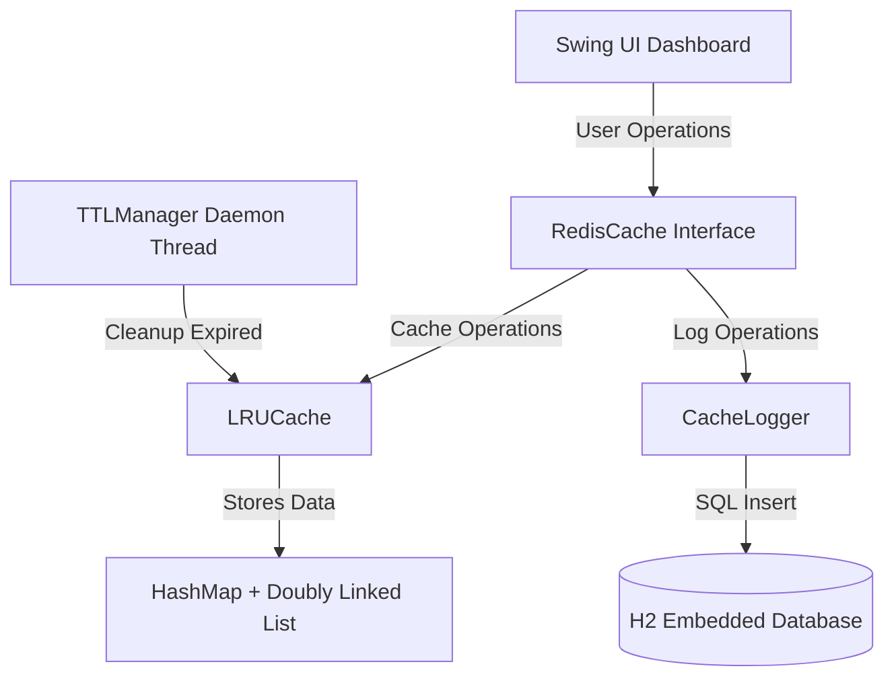

# Redis-Like Cache System with Live Dashboard


A custom-built, in-memory caching system implemented in Java, featuring a Least Recently Used (LRU) eviction policy, Time-To-Live (TTL) key expiration, and a real-time Swing-based GUI dashboard for monitoring operations.

## Problem Statement

Designed to demonstrate core system design principles, this project provides a hands-on implementation of how caching mechanisms work under the hood. It showcases the use of optimal data structures for efficient access and includes real-time observability of cache behavior.

## Key Features

- **LRU Eviction Policy:** Automatically evicts the least recently used items when the cache capacity is reached.
- **TTL Management:** A background daemon thread automatically removes expired keys.
- **Real-Time Dashboard:** A Java Swing/AWT UI visualizing hit rates, memory usage, key counts, and operations.
- **Operation Logging:** An embedded H2 database asynchronously logs cache transactions (SET, GET, DELETE, INCR, DECR).
- **Containerization:** Docker and Docker Compose support for simplified deployment.

## Architecture & Implementation Details



- **Data Structures:** The `LRUCache` achieves `O(1)` time complexity for `GET` and `SET` operations by combining a `HashMap` (for fast lookups) and a Custom Doubly Linked List (for tracking the access order).
- **Thread Safety:** The cache is protected by a `ReentrantReadWriteLock` to allow safe concurrent reads and synchronized writes.
- **TTL Sweeper:** A dedicated `TTLManager` thread runs periodically in the background to clean up keys that have exceeded their time-to-live.

## Technology Stack

- **Language:** Java 21
- **Build Tool:** Maven
- **Database:** H2 Database (Embedded)
- **UI:** Java Swing / AWT
- **Deployment:** Docker & Docker Compose

## Screenshots

<!-- Add your dashboard screenshot here -->


## Installation & Setup

### Prerequisites
- Java 21
- Maven
- (Optional) Docker & Docker Compose

### Running Locally (Maven)

1. Clone the repository and navigate to the project directory:
   ```bash
   cd cache-system
   ```
2. Build the project:
   ```bash
   mvn clean package
   ```
3. Run the application:
   ```bash
   java -jar target/cache-system.jar
   ```
   *Alternatively, run it directly with Maven:*
   ```bash
   mvn exec:java
   ```

### Running with Docker

1. Build and start the container using Docker Compose:
   ```bash
   docker-compose up --build
   ```

*(Note: Since the application launches a Swing GUI, running via Docker requires X11/display forwarding configuration depending on your host OS.)*

## Limitations
- Designed as an in-memory, single-node cache (not distributed).
- The included Swing UI requires a desktop environment/display to run.
- Data persistence is limited to the operation log in the H2 database; the actual cache data is not persisted across restarts.

## Technical Highlights
This project demonstrates applied knowledge of:
- **Data Structures:** Combining Hash Tables and Doubly-Linked Lists for optimal `O(1)` operations.
- **Concurrency & Thread Safety:** Using read-write locks and background daemon threads.
- **System Design Concepts:** Implementing cache eviction strategies (LRU) and TTL functionality.
- **Software Engineering Practices:** Separation of concerns (UI, Core Cache, Database layer) and containerization.
